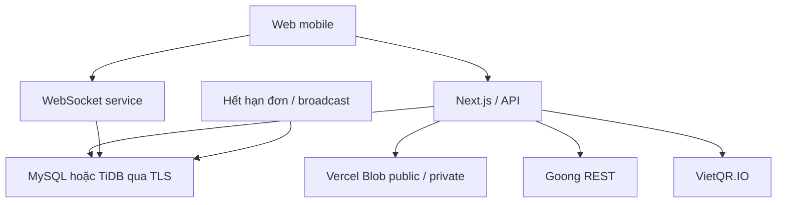
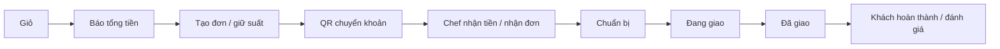

# Tôi gì, bạn đó! — phạm vi và kiến trúc

Cập nhật 03/10/2026 theo yêu cầu triển khai. Cách chạy và trạng thái kiểm chứng nằm trong README.

## Mô hình vận hành

Marketplace đặt món từ bếp cá nhân, ưu tiên điện thoại. Ba vai trò: user, chef, admin. Chef vẫn đặt món như user, tự bố trí giao và nhận chuyển khoản trực tiếp. Mỗi giỏ thuộc một bếp, một bữa, một ngày phục vụ.

MySQL lưu toàn bộ dữ liệu nghiệp vụ, tài khoản, phiên đăng nhập và thông báo. Không dùng Supabase. TiDB là đích database production; cần kiểm thử trên cluster thực trước khi mở bán.

## Công nghệ đã triển khai

| Thành phần | Công nghệ                                                                                                           |
| ---------- | ------------------------------------------------------------------------------------------------------------------- |
| Web/API    | Next.js App Router, React, TypeScript, Node.js                                                                      |
| UI         | CSS responsive, Lucide, font thiết bị, hạn chế font đậm                                                             |
| Database   | MySQL 8, mysql2, SQL migrations, transaction; TLS cho TiDB                                                          |
| Auth       | bcrypt, session ngẫu nhiên lưu hash trong MySQL, cookie HttpOnly                                                    |
| Realtime   | Node HTTP server + ws, JWT ngắn hạn, outbox MySQL                                                                   |
| Ảnh        | Vercel Blob public, Next Image                                                                                      |
| Hồ sơ      | Vercel Blob private, API đọc kiểm tra quyền chủ hồ sơ/admin                                                         |
| Bản đồ     | Goong REST V2, Goong JS tải khi cần                                                                                 |
| Thanh toán | VietQR.IO; chef xác nhận tiền thủ công                                                                              |
| State      | React Context/hooks; giỏ và địa chỉ lưu trên thiết bị                                                               |
| Deployment | Vercel Services: web và realtime; scheduler ngoài gọi `/api/cron` có secret, không yêu cầu cron mỗi phút của Vercel |

Vercel Services hiện ở beta; cấu hình theo [tài liệu Services](https://vercel.com/docs/services) và [hướng dẫn WebSocket](https://vercel.com/kb/guide/real-time-presence-hono-react). Cần kiểm chứng deployment với tài khoản Vercel thực. Dockerfile hỗ trợ chạy WebSocket trên Node host riêng nếu cần.

## User

Thanh điều hướng dưới: Home, Đơn hàng, Thích, Thông báo, Tôi. Header có “Giao đến” và đổi địa chỉ.

- Home xin quyền GPS, tự lưu tọa độ và lấy địa chỉ Goong. Không có quyền thì chọn địa chỉ; khu vực xem mặc định được ghi rõ.
- Tìm món/tên chef, lọc giá và sắp xếp. Banner do admin quản lý.
- Bữa sáng, Bữa trưa, Bữa tối, Quẩy đêm: cutoff do admin đặt, hết giờ tự ngừng nhận.
- Gần bạn: tối đa 10 món trên hàng cuộn ngang; Xem thêm có cuộn tải tiếp và báo hết danh sách.
- Giảm giá: hiện khi sự kiện bật và có món tham gia. Tắt sự kiện trở lại giá gốc.
- Nên thử: rating có trọng số số lượt đánh giá, chỉ món đủ điều kiện trong vùng giao.
- Gợi ý chef: các bếp gần có thực đơn phù hợp, hiển thị rating/số đơn.
- Chi tiết món và chef: giá, thành phần, thời gian chuẩn bị, suất còn lại, thực đơn và đánh giá.
- Đơn hàng: đang xử lý, lịch sử, gợi ý món; chi tiết có QR, timeline, bản đồ và đối soát.
- Thích: lưu/bỏ lưu cả món ngừng nhận. Thông báo gồm Tin tức, Đơn hàng, Khuyến mãi.
- Tôi: profile, voucher, địa chỉ, cài đặt, trợ giúp, chính sách, đăng ký bếp/dashboard.

Giao diện nền trắng, xanh tiết chế, text gọn, không slogan; không chặn tải bằng font ngoài.

## Chef

1. User nộp tên bếp, mô tả, địa chỉ, tọa độ, khu vực, bán kính và tài liệu xác minh.
2. Admin duyệt/từ chối/yêu cầu bổ sung; thông báo kết quả cho chủ hồ sơ.
3. Chef nhập ngân hàng/STK/tên chủ tài khoản; thêm sản phẩm và upload ảnh.
4. Tạo thực đơn hôm nay theo bữa, chọn suất, bật/tắt từng món; đặt giá sale khi có sự kiện.
5. Chủ động mở bếp mỗi ngày. Ngày tiếp theo không tự mở.
6. Nhận đơn qua WebSocket, kiểm tra tiền thực nhận rồi xác nhận.
7. Chuẩn bị → Đang giao → Đã giao; khách xác nhận hoàn thành và đánh giá.

Dashboard: tổng quan, đơn hàng, thực đơn, sản phẩm, cài đặt, hồ sơ riêng tư và thông báo.

## Admin

- Users: danh sách, khóa/mở khóa.
- Chefs: hồ sơ chờ duyệt, đọc tài liệu private, xem ngân hàng, món, đơn và doanh số; duyệt/yêu cầu bổ sung/từ chối/tạm ngưng.
- Sản phẩm: bật/tắt và thông báo lý do cho chef. Đơn: xem timeline, đối soát.
- Cài đặt: cutoff theo giờ Việt Nam, day offset cho bữa qua đêm, phí cố định/phí theo km đường đi.
- Sale: tên, thời gian, bật/tắt; broadcast chefs theo batch.
- Tin tức theo audience user/chef/all; banner, voucher theo chef, xử lý đối soát/hoàn tiền thủ công.
- Tổng quan doanh số hoàn thành; đây là tiền khách chuyển trực tiếp tới bếp, không phải tiền nền tảng đã thu.

## Quy tắc server

Món đủ điều kiện khi bếp đã duyệt, chủ bếp/sản phẩm hoạt động, phiên bếp mở, món bật nhận, còn suất, chưa cutoff và trong bán kính chef. Tạo đơn kiểm tra lại toàn bộ tại server.

- Bán kính dùng Haversine. Goong tính khoảng cách đường đi khi tạo đơn/bản đồ; không gọi cho mỗi thẻ.
- Phí theo km cần Goong. Thiếu Goong chỉ dùng phí cố định và ghi rõ khoảng cách địa lý.
- Database lưu UTC; ngày phục vụ/cutoff theo `Asia/Ho_Chi_Minh`.
- Sale gắn campaign; tắt sự kiện không đổi snapshot đơn đã tạo.
- Transaction khóa hàng, trừ suất, giữ voucher; idempotency key chống đơn trùng; retry giới hạn cho deadlock/conflict.
- Đơn chờ hết hạn sau tối đa 10 phút hoặc cutoff, trả suất/voucher.
- Checkout báo tiền món, phí, voucher, tổng trước khi tạo. Server từ chối nếu tổng thay đổi.
- QR lấy bank/STK/tổng/nội dung từ snapshot server. Khách “đã chuyển” không tự đánh dấu đã trả tiền.
- Thiếu khóa VietQR hiển thị thông tin chuyển thủ công. Hủy/hết hạn sau khi đã chuyển cần chef hoàn tiền ngoài app và ghi nhận đối soát.
- Xe ở giữa tuyến lúc Đang giao là minh họa có nhãn; Đã giao ở điểm đến, chưa phải GPS thật.

## Dữ liệu, realtime và bảo mật

Nguồn schema là `database/*.sql`: users, sessions, chefs, products, meal_settings, kitchen_sessions, daily_menu, campaigns, banners, addresses, favorites, orders/items/events, notifications, realtime_outbox, outbox_receipts, broadcast_jobs, vouchers/redemptions, reviews, assets, audit_logs, platform_settings, payment_exceptions.

SQL có tham số, chỉ backend truy cập database; quyền sở hữu và dữ liệu công khai kiểm tra tại API. Không dùng RLS/PostGIS/RPC PostgreSQL. Tọa độ DOUBLE giúp hỗ trợ TiDB.

Thông báo/outbox ghi cùng transaction. WebSocket kiểm tra origin, JWT 60 giây, session MySQL và người nhận. Reconnect tải lại database. Realtime hoạt động khi trang mở; chưa có Push khi đóng app.

Bcrypt, HttpOnly/SameSite cookie, kiểm tra origin cho mutation, giới hạn thử đăng nhập. Hồ sơ private có auth; upload tối đa 3 MB, kiểm tra loại và signature. Role, giá và quyền xác nhận thanh toán do server quyết định.

## Tốc độ

Server render Home công khai, giới hạn danh sách/tải tiếp, Next Image đúng sizes. Lazy load dashboard/bản đồ. Font thiết bị, icon SVG, không thêm thư viện state/UI lớn. Đơn/session/hồ sơ private không cache công khai. Chưa đo Core Web Vitals production; cần đo trên thiết bị/mạng mobile trong pilot.

## Trước production và phần mở rộng

Cần khóa Goong/VietQR/Blob, TiDB staging, Vercel environment; kiểm thử QR, upload/private access, migrations/TiDB transaction, Services reconnect/scale thật. Hoàn thiện chính sách vận hành, kênh hỗ trợ, xác minh bếp/ngân hàng, hoàn tiền, backup và cảnh báo/quota. Không seed demo vào production.

Chưa triển khai: OTP/Google, quên mật khẩu qua email, Web Push nền, GPS người giao thật, webhook nhận tiền tự động, quyết toán phí nền tảng, sao chép menu ngày trước, thống kê ngày/tuần/tháng nâng cao, tìm kiếm chuyên dụng và tối ưu trên dữ liệu quy mô lớn.
